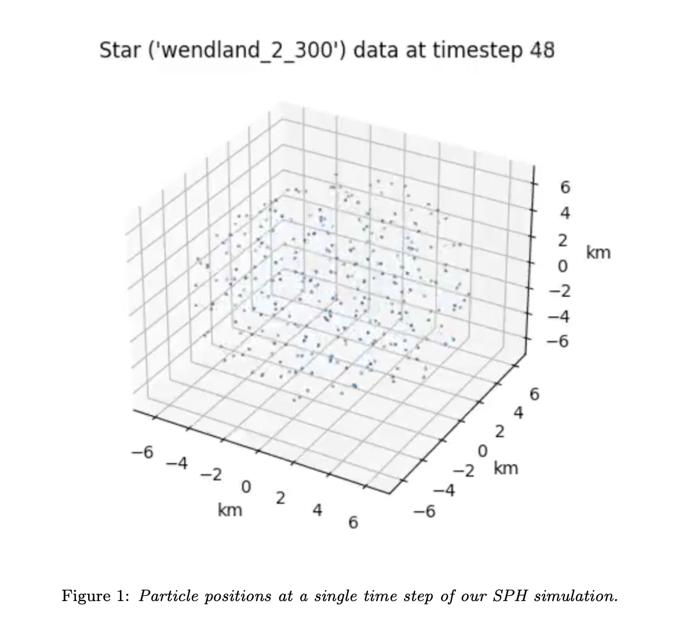
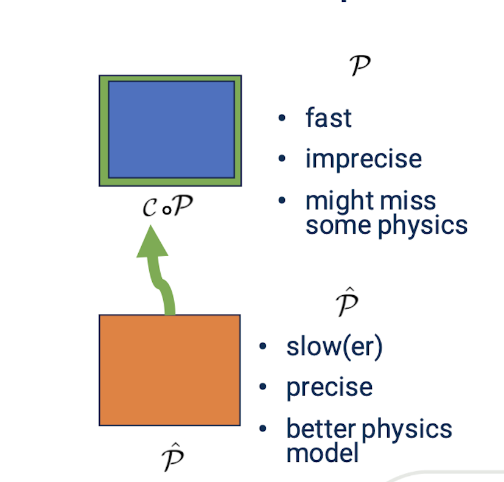
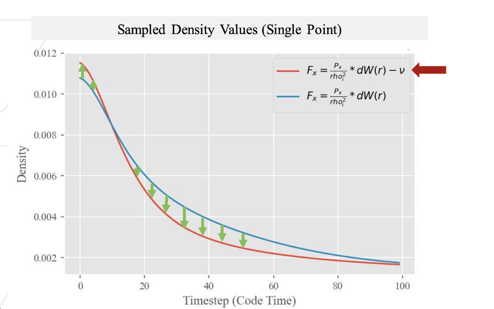

# Abstract

Neutron stars (NSs) stand out as one of the most captivating and perplexing astrophysical phenomena in the
cosmos. These incredibly dense celestial objects, often no larger than a city, pack a mass comparable to that of
our Sun. The stability and internal structure of neutron stars remain the subject of intense scientific inquiry,
driven by their extreme gravity and strong magnetic fields.
The dynamics of such phenomena are often simulated via Lagrangian (particle-based) representations. Sim-
ulating a vast number of points (i.e. more than 1000) per star can be very costly, especially when calculating
different terms such as gravity. We propose a Scientific Machine Learning (SciML) workflow, where incorporating
neural networks (NNs) into our simulation can not only provide formidable speedup (after an initial training
time), but also an opportunity to make our simulation more efficient, and even learn physical terms inside of our
governing equations.
We highlight that despite a general interest in machine learning techniques for astrophysical simulations, they
remain underutilized in the astrophysics community when considering incorperating physically-informed machine-
learning networks for simulating the dynamics of compact objects. We believe that the abundance of simulated
and observed data, paired with a limited understanding of the governing equations behind such processes makes
the field of fluid simulations of compact objects an exciting domain for such solutions.

# SPH Data & NN Architecture

## SPH Data

For our methodology, we utilize an SPH simulation code as outlined in the paper. The simulation code initializes the star as a random collection of points within the star's radius and evolves the points based on an equation of state, SPH density calculation, and artificial viscosity. Using this code, our goal is to make a less precise, but faster solver by bringing it closer to a more precise (but slower) solver. In our case, we use our main simulation as a ground truth. We then run a lower-fidelity version of the NS simulation by reducing the physical accuracy of the involved equations, while keeping the simulation near stability to avoid major divergence. Within the update step of the simulation, we apply a correction term at each time step.  During inference time, we iteratively step the solver forward in time, as usual, but at each time step, we query a neural network (NN) for the correction term, which updates the star point values for the low-fidelity run. 

## NN Archutecture 

For the NN architecture, we first consider a basic multilayer perceptron (MLP) architecture. The correction term induced by the NN in the lower-fidelity simulation can be thought of as acting against the error that was incurred by the finite-dimensional representation. Conceptually, it is implemented in the system the same way as external forces and thus could be thought of as a virtual force imposed by the neural net. The virtual force is a learned force and exactly represents the difference between the ground truth (high-fidelity, slow solver) and the low-fidelity data with reduced physical accuracy. Thus, if we can conceptualize the deviations between the low-fidelity solver and the ground truth, we can understand the physical significance of our correction term. For more details about the specific physics involved in the low-fidelity solver, see section \ref{datamodel} on Data \& Modeling.

# General Modeling

We consider a physical simulation $\mathcal{P}$ that steps the system $\mathbf{x}$ (e.g. particle positions, velocities, and densities) forward in time (in our case the SPH simulation). Further, we consider a higher fidelity (i.e. ''ground-truth'') simulator 
$\hat{\mathcal{P}}$, acting on a system described by $$\mathbf{y}=\mathcal{T}\mathbf{x}$$, where $\mathcal{T}$ is a suitable mapping from $\mathbf{x}$ to $\mathbf{y}$. In the simplest case (e.g. we have the same number of particles with the same parameters and same time step sizes), $\mathcal{T}$ can be the identity function. $\mathcal{T}$ is introduced to model a mapping between the outputs of $\mathcal{S}$ and $\hat{\mathcal{S}}$, where for example $\mathbf{y}$ might be represented on a grid, whereas $\mathbf{x}$ might be discredited on particles. A loss function $$\mathcal{L} \in \mathbb{R}^+_0$$ quantifies the discrepancy between $\mathbf{x}_t$ and $\mathbf{y}_t$, the states at time $t$.

Simulating the system from an initial state $\mathbf{x}_0$ until time $t$ is given by 

$$\mathbf{x}_t = \mathcal{P}\circ\mathcal{P}\ldots\mathcal{P}(x_0) = \mathcal{P}^t(x_0)$$

and

$$\mathbf{y}_t = \hat{\mathcal{P}} \circ \hat{\mathcal{P}} \ldots \hat{\mathcal{P}}(y_0)) = \hat{\mathcal{P}}^t(y_0)$$

We propose to learn a correction function $\mathcal{C}$ to be applied at each step of our simulator $\mathcal{S}$, bringing each $\mathbf{x}_t$ closer $\mathbf{y}_t$.

We would like to minimize the loss $\mathcal{L}$ at each time step $t$. Considering a squared $L_2$ loss, this means minimizing

$$
\mathcal{L} = \sum_{t=0}^{t=T} ||
    \hat{\mathcal{P}}^t(\mathcal{T}\mathbf{x}_0) - (\mathcal{C}\mathcal{P})^t(\mathbf{x}_0)
||_2^2.
$$

